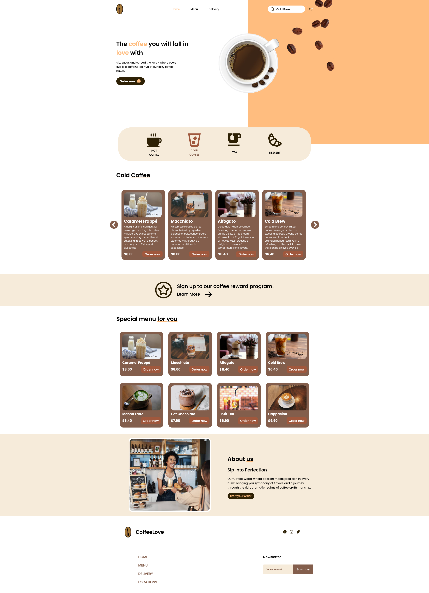

# ☕ Coffee Landing Page

A simple and modern coffee-themed landing page built with HTML, CSS, and JavaScript. Ideal for learning, inspiration, or use as a base for your own projects.

## 🚀 Demo

Check out the live version here: [CoffeeLandingPage Live](https://digambit.github.io/CoffeeLandingPage/)

## ✨ Features

- Clean and modern design
- Responsive layout for all screen sizes
- Smooth scroll and subtle animations
- Modular and easy-to-understand codebase
- Vanilla HTML, CSS, and JS – no frameworks required

## 🎨 Design Overview

### Typography

Main Font: Poppins, sans-serif (imported from Google Fonts)
Used for: All headings and body text

### Color Palette

* Primary Color	#4B3832 -	Deep coffee brown
* Accent Color	#DDB892 -	Warm cream/tan highlight
* Background	#F5F5F5	- Soft gray-beige background
* Text Color	#333333	- Rich dark for readability
  
### Responsive Design

The landing page is fully responsive using media queries.
Layout adjusts for mobile, tablet, and desktop screens.

## 🛠️ How to Use

### Clone the Repository

git clone https://github.com/digambit/CoffeeLandingPage.git

### Customization Tips

Want to make it your own?

* Change colors and fonts in css/style.css.
* Swap images in the assets/ folder.
* Modify text directly in index.html.
* Add sections or animations using plain JavaScript or scroll libraries like AOS.

## 📚 Learning Goals

This project is great for:

* Practicing responsive design
* Writing clean HTML/CSS
* Learning basic JavaScript interactions
* Understanding how to structure simple front-end projects

## 🤝 Contributing

If you'd like to contribute or suggest improvements, feel free to:

* [Buy me a coffee](https://buymeacoffee.com/digambit)
* Fork this repository
* Create a new branch: git checkout -b feature/my-feature
* Commit your changes: git commit -m 'Add my feature'
* Push to the branch: git push origin feature/my-feature
* Open a pull request

## 🪪 License

This project is licensed under the **Creative Commons Attribution-NonCommercial 4.0 International License**.  
You’re free to use it for learning, inspiration, and personal projects — just don’t sell it.  
[Read more here](https://creativecommons.org/licenses/by-nc/4.0/)

## 🙌 Acknowledgments

Thanks to [@asanchezyali](https://github.com/asanchezyali) for inspiration and lots of learning support!

# Made with ❤️ by [@digambit](https://github.com/digambit)
